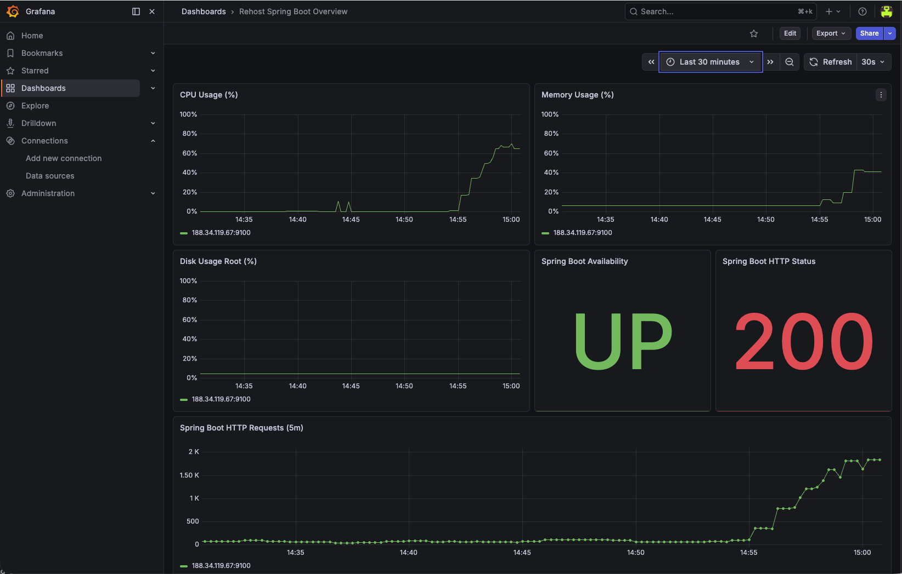

# stackit-cmf-rehost-springboot

Runnable Rehost automation example for STACKIT using Terraform and Ansible.

## What this repo does

- Provisions network/security and a VM in STACKIT via Terraform.
- Assigns a public IP and SSH key.
- Bridges to Ansible to install Java, copy a Spring Boot JAR, and run it as a `systemd` service.
- Optionally provisions STACKIT Observability, registers scrape jobs, and imports a starter Grafana dashboard.

The repository includes a ready-to-deploy sample Spring Boot artifact at `ansible/files/springboot-app.jar`.
By default, Terraform/Ansible deploy this artifact via `jar_local_path = "ansible/files/springboot-app.jar"`.

## Prerequisites

- Terraform `>= 1.5`
- Ansible
- SSH key pair available on your machine (default: `~/.ssh/id_rsa` and `~/.ssh/id_rsa.pub`)
- A STACKIT service account email (used as project owner in `target_project_owner_email`)
- Downloaded JSON key file for this service account (referenced via `service_account_key_path`)
- Permissions for the service account on folder or organization scope so project/network/compute resources can be created
- Parent container ID where the project should be created (`parent_container_id`)

Authentication for this example is based on the service account JSON key file.
`STACKIT_SERVICE_ACCOUNT_TOKEN` is not required.

## Quick start

1. Copy the example variables file:

```bash
cp env.tfvars.example env.tfvars
```

2. Edit `env.tfvars` and set at least:

- `service_account_key_path`
- `target_project_owner_email`
- `parent_container_id`

`bootstrap_project_id` can stay as placeholder when `parent_container_id` is set.

3. Initialize and run Terraform:

```bash
terraform init
terraform plan -var-file=env.tfvars
terraform apply -var-file=env.tfvars
```

To enable observability rollout in the same apply, set these values in `env.tfvars`:

- `enable_observability = true`
- `enable_node_exporter = true`
- `create_grafana_dashboard = true`

Optional (only if your app exposes Prometheus metrics):

- `enable_springboot_metrics_scrape = true`
- `springboot_metrics_path = "/actuator/prometheus"`

Optional (to generate local demo traffic directly from the VM):

- `enable_local_load_generator = true`

4. After apply:

```bash
terraform output vm_public_ip
terraform output application_url
terraform output observability_grafana_url
```

## Observability behavior

- When `enable_observability = true`, Terraform creates a STACKIT Observability instance.
- Ansible installs `prometheus-node-exporter` on the VM and writes custom app health metrics (`springboot_up`, `springboot_http_status_code`) via the textfile collector.
- If `enable_local_load_generator = true`, Ansible also writes request counter metrics (`springboot_http_requests_total`) via the same textfile collector.
- Terraform creates a scrape job for node exporter (`:9100/metrics`).
- Optionally, Terraform also creates a scrape job for `springboot_metrics_path`.
- If `create_grafana_dashboard = true`, Terraform imports `dashboards/rehost-observability-dashboard.json` into Grafana.
- If `enable_local_load_generator = true`, Ansible installs a local load generator (`springboot-loadgen.service` + `springboot-loadgen.timer`) that calls the app endpoint with an irregular burst profile.

### Grafana dashboard snapshot



### Local irregular load profile

You can tune the generated load in `env.tfvars`:

- `springboot_loadgen_target_path` (default: `/`)
- `springboot_loadgen_base_interval_seconds` (default: `8`)
- `springboot_loadgen_randomized_delay_seconds` (default: `8`)
- `springboot_loadgen_burst_min_requests` (default: `40`)
- `springboot_loadgen_burst_max_requests` (default: `160`)
- `springboot_loadgen_enable_stress` (default: `true`)
- `springboot_loadgen_stress_cpu_workers` (default: `2`)
- `springboot_loadgen_stress_vm_workers` (default: `1`)
- `springboot_loadgen_stress_vm_bytes` (default: `40%`)
- `springboot_loadgen_stress_timeout_seconds` (default: `15`)

The timer uses `OnUnitActiveSec` + `RandomizedDelaySec`, and each run sends a random number of requests with short random pauses between requests.
If `springboot_loadgen_enable_stress = true`, each run additionally executes `stress-ng` to generate CPU and RAM pressure.

Request-related exported metrics from the load generator:

- `springboot_http_requests_total`
- `springboot_http_requests_last_burst`
- `springboot_http_requests_last_burst_success`
- `springboot_http_requests_last_burst_failed`
- `springboot_loadgen_stress_enabled`
- `springboot_loadgen_stress_applied`
- `springboot_loadgen_stress_cpu_workers`
- `springboot_loadgen_stress_vm_workers`
- `springboot_loadgen_stress_timeout_seconds`

The default dashboard includes `Spring Boot HTTP Requests (5m)` based on:

`sum by (instance) (increase(springboot_http_requests_total[5m]))`

Security note: with `expose_node_exporter_port = true`, port `9100` is exposed via the security group. Restrict this according to your network policy.

## Spring Boot artifact used for deployment

- Default artifact path: `ansible/files/springboot-app.jar`
- To deploy a different app, replace this file or set `jar_local_path` in `env.tfvars`.

## Destroy

```bash
terraform destroy -var-file=env.tfvars
```

## Notes

- `env.tfvars.example` contains placeholders by design. Fill them in `env.tfvars` before running.
- If your region uses a different image/flavor, adjust `image_id` and `machine_type`.
- `ansible` is triggered automatically by Terraform via `terraform_data`.
